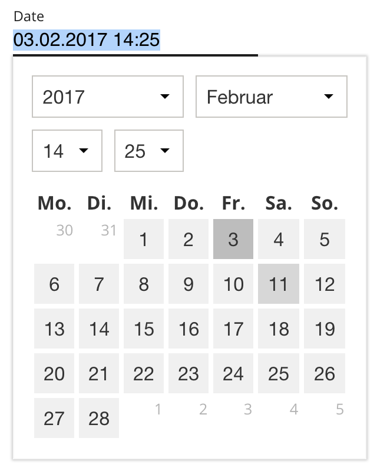

## `datetime-picker` feature

Themeable datetime picker for input elements using the [dpicker library](https://github.com/soyuka/dpicker). It also can be used as MDL component.



### Global dependencies

* [`gi-js-base`](https://github.com/Goldinteractive/js-base)
* [`moment`](https://momentjs.com/)

### Local dependencies

* [`dpicker`](https://github.com/soyuka/dpicker)

### Installation

Install this package with sackmesser:

    make feature-install-datetime-picker

or when sackmesser is not used:

    yarn install gi-feature-datetime-picker

After the installation has completed, you can import the module files:

#### JS:

```javascript
// import feature class
import DatetimePicker from 'gi-feature-datetime-picker'
// ...
base.features.add('datetime-picker', DatetimePicker, {
  // theme class to overwrite theme
  themeClass: '',
  // whether it is used in a mdl project (https://getmdl.io/)
  mdl: false,
  // class for mdl variant
  mdlClass: '-mdl'
  // container class (replacement for "mdl-js-textfield")
  mdlContainerClass: 'mdl-js-datetimefield',

  // whether time selects should be displayed
  time: true,
  // whether meridiem select (AM/PM) should be displayed
  meridiem: false,
  // render order of modules
  order: ['years', 'months', 'time', 'days'],
  // format of the date (can be overwritten by format attribute of the input field)
  format: 'DD.MM.YYYY HH:mm',
  // and more dpicker options (https://github.com/soyuka/dpicker)
  model: moment(),
  min: moment().subtract(2, 'year'), // today -2 years
  max: moment().add(2, 'year') // today +2 years
})
```

Make sure you provide the global dependencies in your webpack config file:

```javascript
new webpack.ProvidePlugin({
  base: 'gi-js-base',
  moment: 'moment'
})
```

#### Styles:

```sass
@import 'gi-feature-datetime-picker/src/style';
```

### Browser compatibility

* Newest two browser versions of Chrome, Firefox, Safari and Edge
* IE 10 and above

### Development

* `make build` or `npm run build` - Build production version of the feature.
* `make dev` or `npm run dev` - Build demo of the feature, run a watcher and start browser-sync.
* `make test` or `npm run test` - Test the feature.
* `make jsdoc` - Update documentation inside the `docs` folder.
* `make publish` - Publish npm package.
